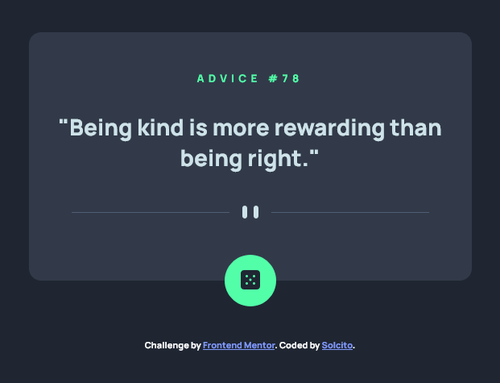
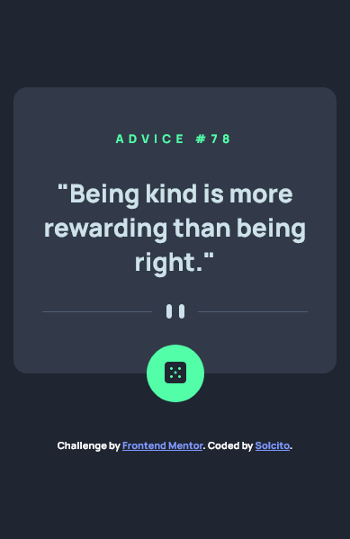

# Frontend Mentor - Advice generator app solution
This is a solution to the [Advice generator app challenge on Frontend Mentor](https://www.frontendmentor.io/challenges/advice-generator-app-QdUG-13db). Frontend Mentor challenges help you improve your coding skills by building realistic projects.

This project was bootstrapped with [Create React App](https://github.com/facebook/create-react-app).\
In the project directory, you can run `npm start`. Runs the app in the development mode.\
Open [http://localhost:3000](http://localhost:3000) to view it in your browser.
The page will reload when you make changes.\
You may also see any lint errors in the console.

## The challenge

Users should be able to:

- View the optimal layout for the app depending on their device's screen size
- See hover states for all interactive elements on the page
- Generate a new piece of advice by clicking the dice icon

## Screenshot

## Built with

- Semantic HTML5 markup
- CSS custom properties
- Flexbox
- Mobile-first workflow
- React JS

## Author

- GitHub - [@solch4](https://github.com/solch4/)
- Frontend Mentor - [@solch4](https://www.frontendmentor.io/profile/solch4)
- LinkedIn - [Sol Maldonado](https://www.linkedin.com/in/sol-maldonado-fullstack/)